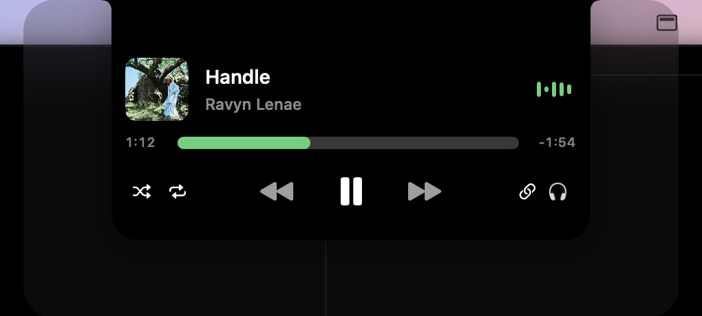
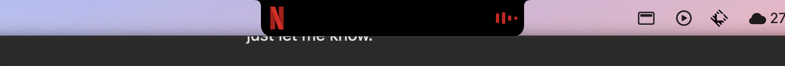
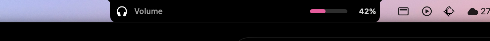

# Islet

A free, open source Dynamic Island for the MacBook notch.

Islet turns the notch into a small, useful place. It shows what is playing, reacts when you plug in
a charger or connect AirPods, replaces the volume and brightness bezels, and parks files for you.
It is native Swift, has no analytics, no account, and no third-party Swift dependencies.

<p align="center">
  
</p>
<p align="center">
  
  
</p>

## Install

1. Download the latest `Islet-x.y.z.zip` from [Releases](https://github.com/DevSrijit/islet/releases).
2. Unzip it and move `Islet.app` to `/Applications`.
3. Open it once with right-click, then **Open**. Islet is not notarized, so macOS asks the first time.

Islet needs macOS 14 Sonoma or later. The live waveform needs macOS 14.2.

Islet lives in the menu bar. Hover the notch to open it, or press `⌃⌥I`.

## What it does

**Now Playing**
- Works with every app that reports media to macOS: Music, Spotify, browsers, video players.
- Artwork, title, artist, scrubber, previous, play, next, shuffle, repeat, copy, and an output device switcher.
- Shows the site icon for browser media, so YouTube looks like YouTube and Netflix looks like Netflix.
- A waveform in the closed notch. Turn on the live waveform to drive it from the audio itself.
- Artwork flips when the track changes. The UI tints itself from the artwork.

**Peeks in the closed notch**
- Battery: charging, unplugged, low battery, and Low Power Mode. Plays the MacBook charging chime.
- Connectivity: AirPods, Beats, keyboards, mice, and controllers, with battery levels when they report them.
- Focus: shows the Focus that turned on or off.
- Calendar: a reminder before the next event, and the current or next event in the open island.
- Finished downloads and Caps Lock.

**HUDs**
- Volume, brightness, and keyboard backlight in the notch, in white, accent, glow, or decibel styles.
- Optional: hide the system bezels so only Islet's HUDs show.

**Shelf**
- Drag files onto the notch to park them. Drag them back out anywhere.
- AirDrop, Quick Look, open, or reveal in Finder from the context menu.

**Feel**
- Two-finger swipe down to open, up to close, left or right to change tracks.
- Haptic feedback on the trackpad.
- Progressive blur behind the open island.
- Works on Macs without a notch with a simulated one, and on external displays.
- Shortcuts actions: Toggle Islet, Play or Pause, Next Track.

## Permissions

Islet asks for each permission only when you turn the related feature on.

| Feature | Permission | Why |
| --- | --- | --- |
| Calendar | Calendars | Reads today's events |
| Site icons | Automation for your browser | Asks which tab is playing |
| Live waveform | System Audio Recording | Reads the output level. Nothing is stored |
| Caps Lock peek | Accessibility | macOS only reports key state to trusted apps |

## How Now Playing works

macOS 15.4 removed MediaRemote access for third-party apps. Islet bundles
[MediaRemoteAdapter](https://github.com/ungive/mediaremote-adapter), a BSD-licensed helper that runs
inside the system Perl interpreter, which macOS still trusts. Islet reads a JSON stream from it. No
per-app integrations, no scripting of Spotify or Music.

## Build from source

```sh
brew install xcodegen
git clone https://github.com/DevSrijit/islet.git
cd islet
xcodegen generate
open Islet.xcodeproj
```

Or build a release zip:

```sh
scripts/release.sh
```

See [CONTRIBUTING.md](CONTRIBUTING.md) and [docs/ARCHITECTURE.md](docs/ARCHITECTURE.md).

## Roadmap

- Lock screen widgets.
- Weather on empty days.
- Hide in Mission Control and while gaming.
- Time-to-leave alerts.

## License

MIT. See [LICENSE](LICENSE). Third-party notices are in [THIRD_PARTY_NOTICES.md](THIRD_PARTY_NOTICES.md).

Islet is an independent project. It is not affiliated with Apple or with any other notch app.
