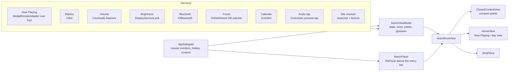

# Islet architecture

Islet is one process with three layers: services that watch the system, one view model that
turns their events into notch state, and SwiftUI views that draw the notch inside a floating panel.

## The panel

`NotchPanel` is a borderless, non-activating `NSPanel` at window level `mainMenu + 3`. It joins all
Spaces and stays visible over full screen apps. The panel is larger than the notch so the open island
and its blur halo have room. Transparent parts of the panel pass clicks through to whatever is below.

`NotchGeometry` reads the real notch size from `NSScreen.safeAreaInsets` and the auxiliary top areas.
On a Mac without a notch it can simulate one. The user can nudge the size by a point or two because
panel tolerances vary between units.

## Sizing rule

The closed notch always grows by the same amount on both sides. `ClosedContentView` measures its
leading and trailing content, reports the widths to the view model, and the view model uses the
larger of the two for both sides. The physical notch region always stays empty.

## Mouse and gestures

The app never becomes key. `AppDelegate` installs global and local `NSEvent` monitors:

- `mouseMoved` drives hover. The view model opens after a short delay and closes after the pointer leaves.
- `leftMouseDragged` with a file on the drag pasteboard opens the shelf when the drag reaches the notch.
- `scrollWheel` over the notch maps two-finger swipes to open, close, next, and previous.

## Now Playing

macOS 15.4 removed MediaRemote access for third-party apps. The bundled MediaRemoteAdapter runs inside
`/usr/bin/perl`, which macOS still trusts, and streams JSON lines over a pipe. `NowPlayingService`
applies the diffs and publishes a `NowPlaying` value. Commands (play, seek, shuffle, repeat) run the
same script once with arguments.

For browsers, `MediaSourceResolver` asks the browser for its tabs through AppleScript, matches the
playing title, and fetches that site's favicon. This is how Islet shows a YouTube or Netflix icon
without shipping any brand assets.

## Live waveform

`AudioLevelTap` creates a global CoreAudio process tap on macOS 14.2 and later. The IO callback runs
four one-pole filters per sample and stores four band energies behind an unfair lock. A 30 Hz timer
publishes smoothed values to SwiftUI. The tap only runs while music is playing and the compact
waveform is visible.

## Settings

`Preferences` is generated from the table in `scripts/gen-preferences.py`. Each property writes
through to `UserDefaults` and posts a notification with the key name. `AppDelegate` and the view
model react to the keys they care about.
